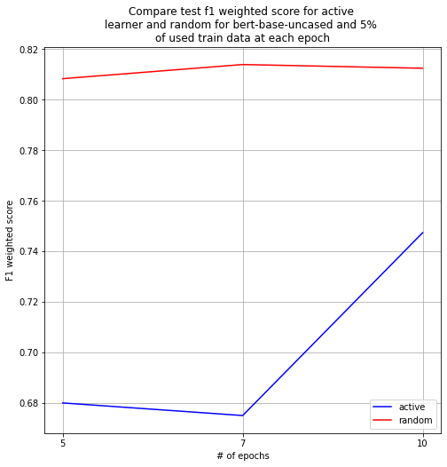
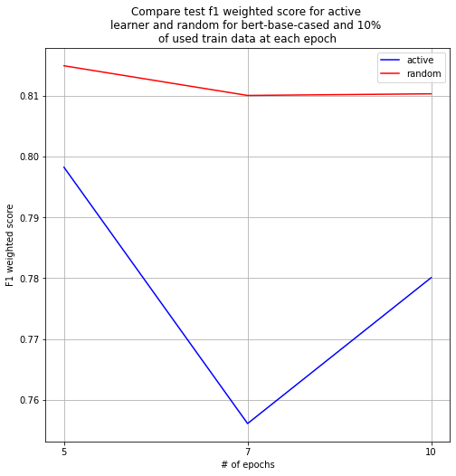
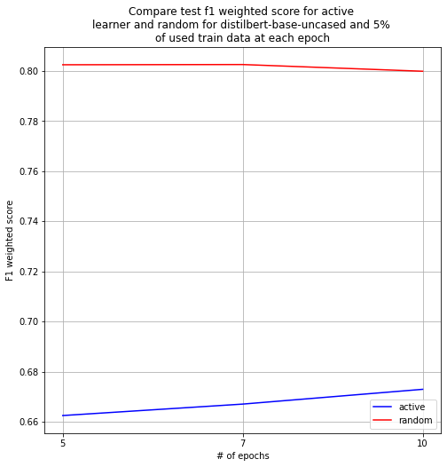

# Abstract

----
In this project was develop train pipeline of active learning for classification of dialog acts. After each epoch some
dialogs with bad performance were chosen to continue train model

# Approach

---
Top level
---
---
Three transformer based NLP models(bert-base-uncased, distilbert-base-uncased, bert-base-cased) were chosen to train.
For first epoch 10% of train data were selected to initial train the model. Then at each epoch some percents of data
with the worst performance were used to continue train models.  
The trained model will be compared with model, which train same size of random dialog data.

Implementation notes
---
---
To load models and dataset huggingface library was used.  
Additionally, scripts were added:

* train.py - entry point of training pipeline
* trainer.py - script contains Trainer class, which introduced steps of training/evaluation of pipeline.
* metric.py - custom classes to evaluate model performance to select dialogs with bad performance.
* data.py - script contains pytorch data samplers to resample data to select dialogs with bad performance or select
  random dialogs.

# Results

---
Next results were obtained:

| model                   |   percent |   num_epochs |   f1 weighted active |   f1 weighted random |   accuracy active |   accuracy random |
|:------------------------|----------:|-------------:|---------------------:|---------------------:|------------------:|------------------:|
| bert-base-cased         |         5 |            5 |             0.649843 |             0.807733 |          0.623902 |          0.813824 |
| bert-base-cased         |         5 |            7 |             0.683322 |             0.811054 |          0.697674 |          0.819897 |
| bert-base-cased         |         5 |           10 |             0.67183  |             0.810838 |          0.671576 |          0.819509 |
| bert-base-cased         |        10 |            5 |             0.798243 |             0.814954 |          0.798062 |          0.819897 |
| bert-base-cased         |        10 |            7 |             0.75607  |             0.81007  |          0.795995 |          0.816279 |
| bert-base-cased         |        10 |           10 |             0.780081 |             0.81034  |          0.797545 |          0.818863 |
| bert-base-cased         |        15 |            5 |             0.716154 |             0.806315 |          0.702326 |          0.808269 |
| bert-base-cased         |        20 |            5 |             0.760637 |             0.797253 |          0.747933 |          0.814083 |
| bert-base-uncased       |         5 |            5 |             0.680099 |             0.808312 |          0.685917 |          0.821447 |
| bert-base-uncased       |         5 |            7 |             0.675121 |             0.813899 |          0.648837 |          0.823127 |
| bert-base-uncased       |         5 |           10 |             0.747408 |             0.812433 |          0.759948 |          0.822093 |
| bert-base-uncased       |        10 |            5 |             0.769555 |             0.813752 |          0.794315 |          0.82261  |
| bert-base-uncased       |        10 |            7 |             0.796707 |             0.813816 |          0.801809 |          0.81938  |
| bert-base-uncased       |        10 |           10 |             0.767749 |             0.814687 |          0.794057 |          0.821059 |
| bert-base-uncased       |        15 |            5 |             0.699173 |             0.812425 |          0.685271 |          0.814212 |
| bert-base-uncased       |        20 |            5 |             0.773005 |             0.808109 |          0.761499 |          0.820284 |
| distilbert-base-uncased |         5 |            5 |             0.662461 |             0.802444 |          0.63863  |          0.813824 |
| distilbert-base-uncased |         5 |            7 |             0.667028 |             0.802532 |          0.680879 |          0.814858 |
| distilbert-base-uncased |         5 |           10 |             0.672928 |             0.799854 |          0.662274 |          0.810078 |
| distilbert-base-uncased |        10 |            5 |             0.775482 |             0.803715 |          0.77261  |          0.812661 |
| distilbert-base-uncased |        10 |            7 |             0.78034  |             0.80351  |          0.798062 |          0.814858 |
| distilbert-base-uncased |        10 |           10 |             0.784606 |             0.805672 |          0.786822 |          0.814729 |
| distilbert-base-uncased |        15 |            5 |             0.626048 |             0.804187 |          0.614599 |          0.810724 |
| distilbert-base-uncased |        20 |            5 |             0.75217  |             0.79569  |          0.739406 |          0.809948 |

# Conclusion

---

 